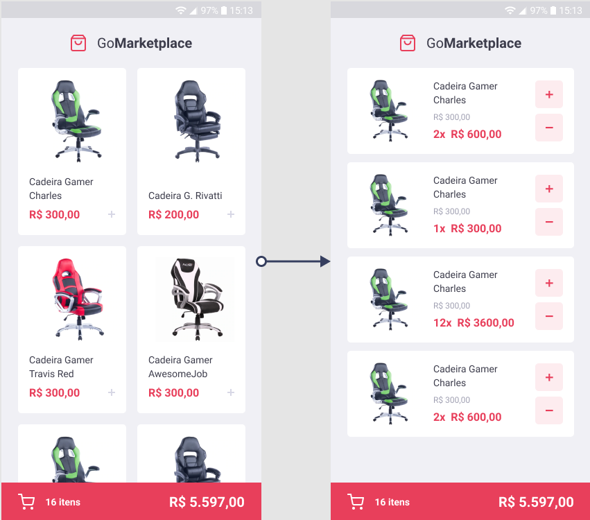

<h1 align="center">
    
    <br>
    GoMarketPlace
</h1>

<h3 align="center">
  Desafio 08: Fundamentos do React Native
</h3>

<div align="center">
  
  <br>
</div>

<p align="center">
  

  


 

  <a href="https://github.com/BergCastro/ecoleta-rocketseat-nwl1/commits/master">
    
  </a>

  
</p>

<p align="center">
  <a href="#rocket-technologies">Technologies</a>&nbsp;&nbsp;&nbsp;|&nbsp;&nbsp;&nbsp;
  <a href="#information_source-how-to-use">How To Use</a>&nbsp;&nbsp;&nbsp;|&nbsp;&nbsp;&nbsp;
  <a href="#memo-license">License</a>
</p>


## :rocket: Technologies

This project was developed with the following technologies:

-  [Javascript](https://developer.mozilla.org/pt-BR/docs/Aprender/JavaScript)
-  [TypeScript](https://www.typescriptlang.org/)
-  [React](https://pt-br.reactjs.org/)
-  [React Native](https://reactnative.dev/)
-  [styled-components](https://www.styled-components.com/)


## :information_source: How To Use

To clone and run this application, you'll need [Git](https://git-scm.com), [Node.js v10.16][nodejs] or higher installed on your computer. From your command line:


```bash
# Clone this repository
$ git clone https://github.com/BergCastro/gostack-gomarketplace-desafio8 gomarketplace


```

### Install dependecies

```
$ yarn

```

### Server

```bash

$ yarn json-server server.json -p 3333

```

### Mobile

```bash

# setup ports device
$ adb reverse tcp:3333 tcp:3333

# run app
console 1: $ yarn start

console 2: $ yarn android

```

## :memo: License
This project is under the MIT license. See the [LICENSE](https://github.com/BergCastro/gostack-gomarketplace-desafio8/blob/master/LICENSE) for more information.

---

♥ In love for javascript - Lindemberg Castro : [See!](https://www.linkedin.com/in/lindemberg-castro/)
